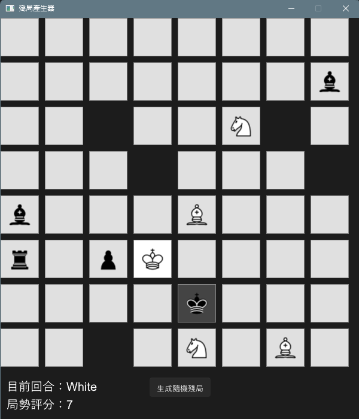
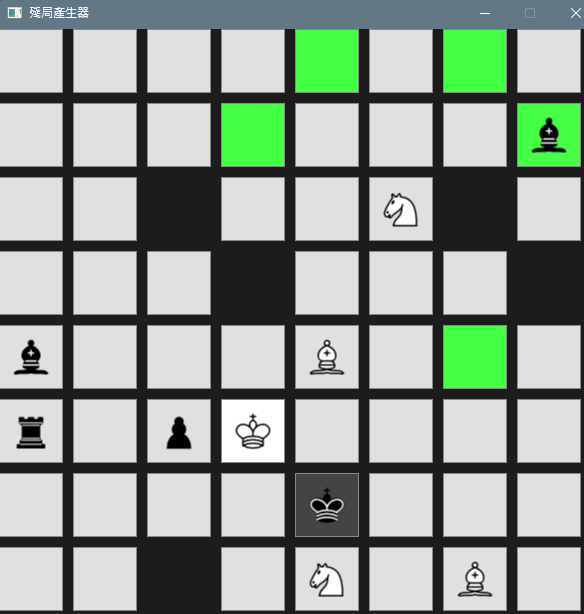

# Chess?
## How to test it?
```bash
# test file path: ./test/*
cargo test --test <test file> #e.g. board_test

# or 
cargo test

# or 
cago test -- --nocapture # see rust print!
```

## How to run it?
```bash
cargo run

# or
cargo build --release
./target/release/main #.\target\release\main 
```

<br/>

## Imgs
### Window
 
### Movement
 